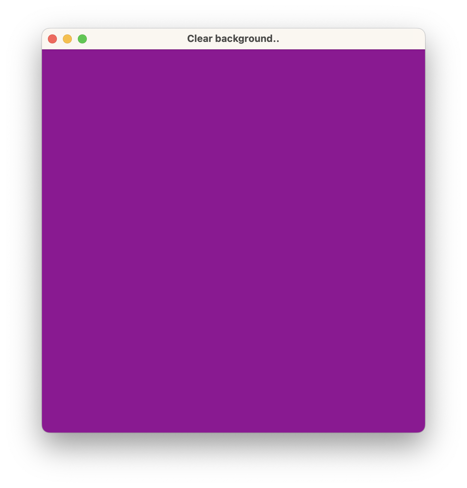

# Metal — Animated Clear Background (Command Line)

The simplest possible Metal app built and run entirely from the command line — no Xcode project required. It opens a 512×512 `MTKView` and animates the background colour by incrementing the red and blue clear-colour channels every frame, cycling through a purple/magenta gradient.

## Output



## What it does

- Creates a `NSWindow` and a custom `MTKView` programmatically with no `.xib` or storyboard
- Each frame, increments a `color` value from 0→1 in a loop and sets it as both the red and blue clear-colour channels, producing an animated purple cycle
- Encodes a single render pass that does nothing but clear the drawable to that colour, then presents it

## Approach

### Triple-buffered semaphore

A `dispatch_semaphore_t` with a count of 3 (matching the Metal swap chain depth) is used to prevent the CPU from getting more than 3 frames ahead of the GPU:

```objc
dispatch_semaphore_wait(mtlSemaphore, DISPATCH_TIME_FOREVER);   // CPU waits if 3 frames in-flight
// ... encode & commit ...
[commandBuffer addCompletedHandler:^(id<MTLCommandBuffer> buffer) {
    dispatch_semaphore_signal(semaphore);                        // GPU signals when frame is done
}];
```

### Render pass — clear only

No geometry or shaders are needed. The render pass descriptor is configured to clear the attachment and store the result:

```objc
passDescriptor.colorAttachments[0].loadAction  = MTLLoadActionClear;
passDescriptor.colorAttachments[0].storeAction = MTLStoreActionStore;
passDescriptor.colorAttachments[0].clearColor  = MTLClearColorMake(color, 0, color, 1);
```

An encoder is created, the viewport is set, and encoding ends immediately — no draw calls.

## Build & Run

No Xcode needed. Compile and run with the provided shell script:

```sh
./rumCmd.sh
```

Which executes:

```sh
clang++ -framework Cocoa -framework Metal -framework MetalKit main.mm -o main.out
```

## Project Structure

```
MetalCmdlineClearBackground/
├── main.mm      # Entire app — window, MTKView, render loop
├── rumCmd.sh    # One-line build script
└── main.out     # Compiled binary (generated)
```
