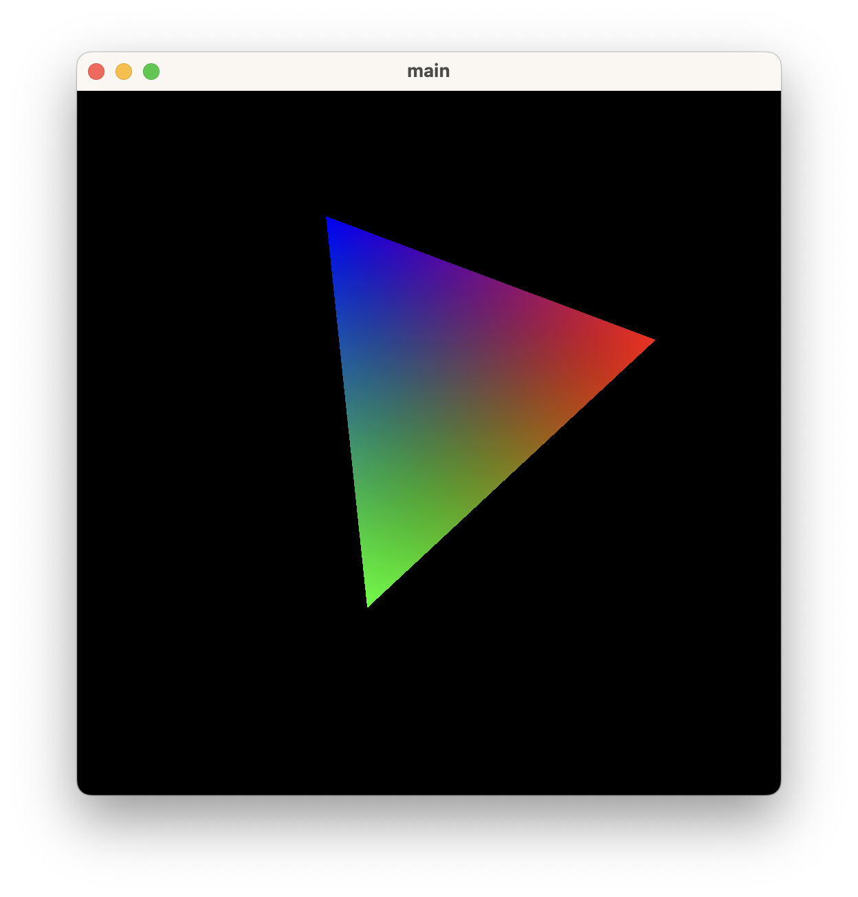

# Metal — Hello World Triangle (Command Line)

A minimal Metal app written in Objective-C++ that renders a smoothly rotating RGB triangle — built and run entirely from the command line with no Xcode project required.

## Output



## What it does

- Creates an `NSWindow` and a custom `MTKView` programmatically with no `.xib` or storyboard
- Loads a pre-compiled `shaders.metallib` from disk at runtime
- Draws a single triangle with per-vertex colours (red, green, blue) interpolated across the surface
- Rotates the triangle every frame by incrementing a rotation angle and uploading a new rotation matrix to the uniform buffer

## Approach

### Shader loading from file

Because this is a plain command-line binary (not an app bundle), the metallib is loaded by path rather than from `mainBundle`:

```objc
NSString* shaderPath = [[NSBundle mainBundle] pathForResource:@"shaders" ofType:@"metallib"];
metalLibrary = [self.device newLibraryWithURL:[NSURL fileURLWithPath:shaderPath] error:&error];
```

`shaders.metallib` must be in the same directory as the `main` binary.

### Triple-buffered uniforms

Three uniform buffers are cycled using a `dispatch_semaphore_t` (count = 3) to keep the CPU and GPU pipeline full without stalling:

```objc
dispatch_semaphore_wait(semphore, DISPATCH_TIME_FOREVER);
// update uniforms, encode, commit ...
[commandBuffer addCompletedHandler:^(id<MTLCommandBuffer> buffer) {
    dispatch_semaphore_signal(chkSemaphore);
}];
```

### Rotation

A 2D rotation matrix is built each frame from the accumulated angle and uploaded as a `float4x4` uniform:

```objc
float rad = frame * 0.01f;
float sin = std::sin(rad), cos = std::cos(rad);
simd::float4x4 rotation({ cos,-sin,0,0 }, { sin,cos,0,0 }, { 0,0,1,0 }, { 0,0,0,1 });
uniforms->projectionViewModel = rotation;
```

### Vertex colour

Colours are stored as `unsigned char[4]` in the vertex buffer and declared as `MTLVertexFormatUChar4` in the vertex descriptor. The shader divides by 255 to normalise to `[0, 1]`:

```metal
out.color = in.color / 255.0;
```

## Build & Run

```sh
make        # compiles main binary and shaders.metallib
./main
```

To rebuild only the shaders:

```sh
./buildBinaryShader.sh
```

## Project Structure

```
MetalCmdlineHelloWorld/
├── main.mm               # App, window, MTKView, render loop
├── shaders.metal         # Vertex and fragment shaders
├── structure.h           # Shared enums and structs (buffer indices, uniforms)
├── Makefile              # Builds main binary and shaders.metallib
└── buildBinaryShader.sh  # Standalone shader-only build script
```
