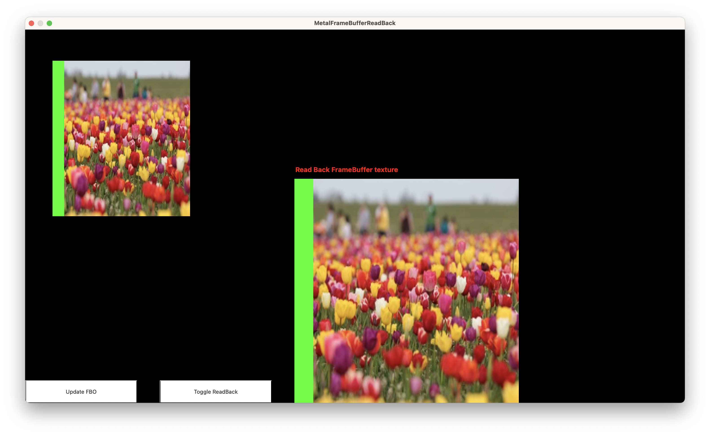

# Metal — Frame Buffer Object (FBO) Capture (Command Line)

Demonstrates off-screen rendering into a Metal FBO (Frame Buffer Object) and reading pixel data back to the CPU — built and run entirely from the command line with no Xcode project required.

## Output



The window shows:
- **Top-left quad** — the FBO texture rendered onto the MTKView (green clear colour visible around the image)
- **Right NSImageView** — the CPU read-back of either the FBO texture or the MTKView drawable, reconstructed as an `NSImage`
- **Buttons** — `Update FBO` re-renders into the FBO; `Toggle ReadBack` switches the read-back source

## What it does

1. Loads a JPEG image from alongside the binary into a Metal texture
2. Renders that texture into an off-screen 500×500 FBO using an orthographic projection
3. Displays the FBO texture on screen by drawing it as a textured quad into the MTKView
4. On every frame, reads pixel data back from either the **FBO colour texture** or the **MTKView drawable**
5. Swizzles BGRA → RGBA and wraps the bytes in a `CGImage` → `NSImage` shown in the `NSImageView`

## Approach

### FBO texture requirements

The off-screen colour texture must use `MTLStorageModeManaged` and include `MTLTextureUsageShaderRead` so the CPU can read it back:

```objc
desc.storageMode = MTLStorageModeManaged;
desc.usage       = MTLTextureUsageRenderTarget | MTLTextureUsageShaderRead;
```

### MTKView read-back requirement

To allow reading back the live drawable, `framebufferOnly` must be disabled:

```objc
frameBufferView.framebufferOnly = NO;
```

### Pixel read-back

```objc
[texture getBytes : pixelBytes
         bytesPerRow : bytesPerRow
          fromRegion : region
         mipmapLevel : 0];
```

### Orthographic projection

Both the FBO pass and the display pass use a CPU-side ortho matrix so vertices can be specified in pixel coordinates:

```objc
uniforms->projectionViewModel = Ortho(0, width, height, 0, -1, 1);
```

## Build & Run

```sh
make        # compiles binary, shaders.metallib, copies 1.jpg
./main
```

### What `make` does

| Step | Command |
|---|---|
| Compile app | `clang++ -std=c++11 -framework Cocoa -framework Metal -framework MetalKit -fobjc-arc main.mm -o main` |
| Compile shaders | `xcrun -sdk macosx metal shaders.metal -o shaders.metallib` |
| Copy texture | `cp textures/photos/1.jpg 1.jpg` |

> `shaders.metallib` and `1.jpg` must sit alongside the `main` binary because `NSBundle` for a plain executable resolves resource paths to the binary's directory.

To clean:

```sh
make clean
```

## Project Structure

```
MetalFrameBufferCapture/
├── main.mm               # App, window, MTKView, FBO setup, render loop, read-back
├── shaders.metal         # Vertex (ortho transform) and fragment (texture sample) shaders
├── common.h              # Shared enums and structs (buffer indices, uniforms)
├── Makefile              # Builds binary, metallib, copies resources
├── textures/
│   └── photos/1.jpg      # Source image rendered into the FBO
├── AppDelegate.h/m       # Xcode scaffolding (unused)
└── Info.plist            # Xcode scaffolding (unused)
```
