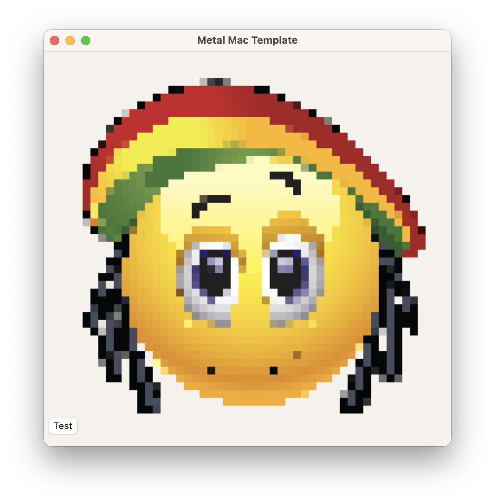

# Metal — Pixelate Filter (GPU Compute)

Demonstrates using a Metal **compute kernel** to apply a pixelate effect to an image entirely on the GPU. The result is read back to the CPU and displayed in an `NSImageView`.

## Output

| Input | Output |
|---|---|
|  |  |

## What it does

1. Loads `cartoon.png` from the app bundle into CPU memory
2. Swizzles the pixels from RGBA → ARGB and uploads them to a Metal input buffer
3. Dispatches a compute kernel (`pixelate`) that groups pixels into 10×10 blocks — each pixel in a block reads the colour from the block's top-left corner
4. Reads the output buffer back to the CPU
5. Reconstructs a `CGImage` → `NSImage` and displays it in the `NSImageView`

## Approach

### Compute pipeline

Metal's compute pipeline is used instead of the render pipeline — there are no vertices, no draw calls, just a kernel dispatched over a 2D grid matching the image dimensions:

```objc
threadGroupCount = MTLSizeMake(16, 16, 1);  // threads per group
threadGroups     = MTLSizeMake(32, 32, 1);  // number of groups (covers 512x512)
[commandEncoder dispatchThreadgroups:threadGroups threadsPerThreadgroup:threadGroupCount];
```

### Pixelate kernel

The kernel snaps each thread's pixel coordinate to the nearest block origin and copies that block's colour to the output:

```metal
kernel void pixelate(device unsigned int* inBuffer  [[buffer(1)]],
                     device unsigned int* outBuffer [[buffer(0)]],
                     uint2 gid [[thread_position_in_grid]])
{
    uint pixelate = 10;
    const uint2 pixellateGrid = uint2((gid.x / pixelate) * pixelate,
                                      (gid.y / pixelate) * pixelate);
    const unsigned int colorAtPixel = inBuffer[pixellateGrid.y * 512 + pixellateGrid.x];
    outBuffer[gid.y * 512 + gid.x] = colorAtPixel;
}
```

### Buffer binding

- `buffer(0)` — output buffer (written by the kernel)
- `buffer(1)` — input buffer (read by the kernel)

## Build

Open `Pixelate.xcodeproj` in Xcode and press **Run** (⌘R).

## Project Structure

```
Pixelate/
├── Pixelate/
│   ├── MyView.m            # MTKView subclass: setup, compute dispatch, read-back, display
│   ├── MyView.h
│   ├── Shaders.metal       # Pixelate compute kernel
│   ├── GameViewController.m/h
│   ├── AppDelegate.m/h
│   └── cartoon.png         # Source image
└── Pixelate.xcodeproj
```
